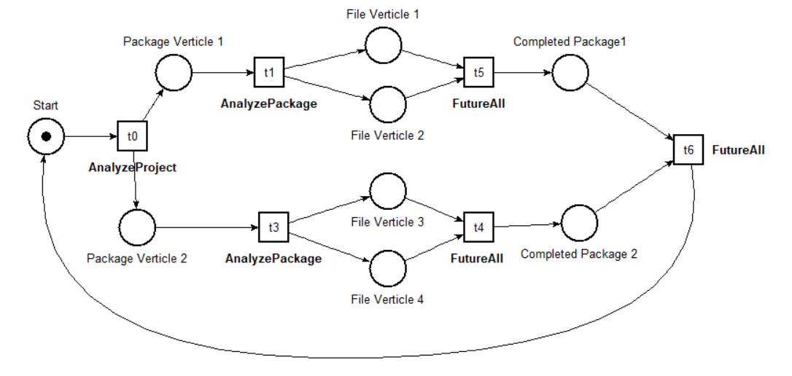
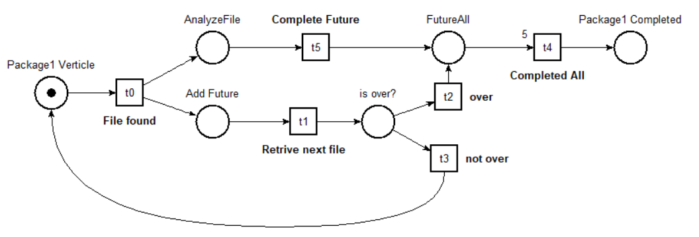
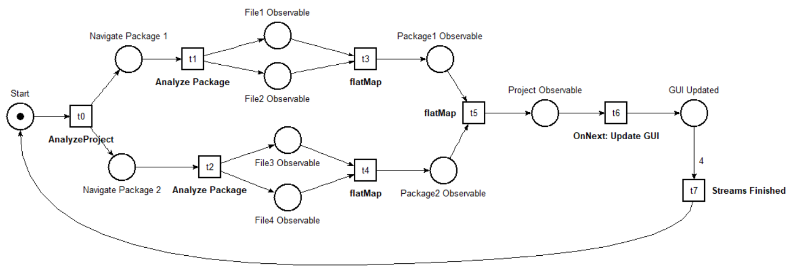
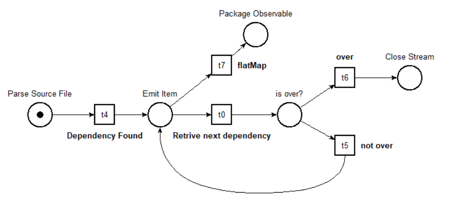

# Report Assignment-02
*_Concurrent and Distributed Programming_*

*_Muhamad Huseyn Salman_*

---

## Table of Contents
- [Async Programming](#async-programming)
    - [Design](#design)
    - [Behavior](#behavior)
- [Reactive Programming](#reactive-programming)
    - [Design](#design-1)
    - [Behavior](#behavior-1)

---

## Async Programming

### Design

The application is built around three Verticle classes:

1. `ClassAnalyserVerticle`: reads and parses a Java source file using Vert.x filesystem and Java Parser. It produces a `ClassDepsReport`.
2. `PackageAnalyserVerticle`: lists Java source files in a given package and deploys a `ClassAnalyserVerticle` for each file. Then it awaits all class analysis tasks and aggregates the results into a `PackageDepsReport`.
3. `ProjectAnalyserVerticle`: recursively explores the project directory structure, deploying a `PackageAnalyserVerticle` for each folder. It then awaits all package analysis tasks and aggregates the results into a `ProjectDepsReport`.

Each verticle receives a promise used by the caller to monitor execution state and await results. Internally, each verticle has various asynchronous methods representing the steps required to complete its task, chained in the `start` method.

All file and directory access is handled through the Vert.x filesystem to avoid blocking the event-loop. Parsing with Java Parser and AST navigation is offloaded via `executeBlocking`, delegating work to a worker thread.

### Behavior

The following Petri Net illustrates the high-level behavior of the library. It emphasizes that packages and files are analyzed in parallel using different verticles. Their futures are then combined using `FutureAll`.

The next Petri Net shows detailed async behavior of the `PackageVerticle` and `FileVerticle`. The `PackageVerticle` deploys a new `FileVerticle` for each file, which asynchronously parses the source and returns a `FileReport`. These are aggregated into a `PackageReport` after all futures complete.

---

## Reactive Programming

### Design

The backend relies on four core methods:

1. `extractDependencies`: reads and parses a Java source file, emitting an item for each dependency found. Produces a `SingleDependencyResult` observable.
2. `analyzeFile`: subscribes to the dependency stream of a file and adds file/package metadata to each emitted item.
3. `analyzePackage`: invokes `analyzeFile` for each file in a package and flattens results into a single dependency stream.
4. `analyzeProject`: invokes `analyzePackage` for each package in the project and flattens results into a unified dependency stream.

To avoid blocking the main thread, I/O and parsing are scheduled on an I/O-optimized thread pool using RxJava's `subscribeOn`.

#### Swing GUI

The GUI uses RxJava to handle `ActionEvents` reactively via a `PublishSubject`.  
Upon analysis start, it subscribes to the stream returned by `analyzeProject`. For each dependency received, the graph panel is incrementally re-rendered.

- Source file nodes are assigned random colors.
- Dependency file nodes use grayscale shades.
- A legend panel updates incrementally with each new dependency.
- Node positions are randomized on the panel.
- Three counters at the bottom track the number of files, packages, and dependencies analyzed.

### Behavior

The Petri Net below shows the high-level behavior of the application. It highlights parallel production and combination of data streams which eventually reach the GUI. Each observable can be thought of as a cyclic Petri Net emitting one token per dependency.

The next diagram details how the core stream emits parsed dependencies. This token stream is processed at the package and project levels, ultimately updating the GUI incrementally.

